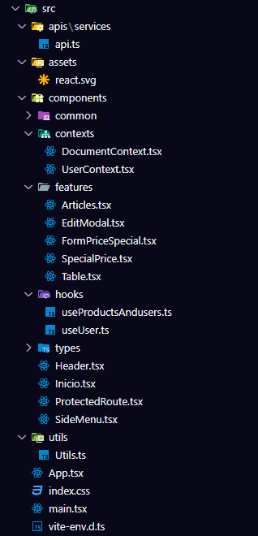

# React + TypeScript + Vite
# Proyecto: Desafío React / MongoDB

## **Introducción**

Este es el frontend de una aplicación de gestión de precios especiales, diseñada para interactuar con una API de backend que maneja productos, usuarios y precios especiales. La aplicación permite a los administradores gestionar precios especiales para los productos de acuerdo con ciertos usuarios, y a los clientes ver los productos con sus precios aplicados dependiendo de sus roles.

El frontend está desarrollado utilizando **React** y **Tailwind CSS** para un diseño responsivo y eficiente. La navegación entre las páginas está controlada por **React Router**, y las interacciones con la API se realizan a través de **Axios**.

## **Pasos para Ejecutar Localmente**

### 1. **Clonar el repositorio**

Clona este repositorio en tu máquina local:

```bash
git [clone https://github.com/tu-usuario/proyecto.git](https://github.com/LuisFernandoMazo/Desafio-React-MongoDB-Frontend.git)
cd nombre de la carpeta
```

## Frontend (React.js)

### Pasos para ejecutar localmente

1. **Instalar dependencias**:
   npm install

2. **Configuración de variables de entorno**
   Crear un archivo .env en la raíz del proyecto con las siguientes variables:
   VITE_SERVER_URL=http://localhost:3000/

4.**Ejecutar el frontend:**
npm run dev
➜ Local: http://localhost:5173/
➜ Network: use --host to expose
➜ press h + enter to show help

### Roles 
Actualmente se maneja dos roles "cliente" y "admin". El rol cliente permite acceder a la sección de articulos y el rol admin permite acceder a todos las secciones. 

### ¿Cómo ingreso a la plataforma?
Actualmente hay varios usuarios creados en al colección "usuariosMazo18", con los cuales se puede probar serian: 
Cliente Prueba : 123456
Solo tendría la disponibilidad de observar la siguiente sección:
__________


Admin Prueba : 123456789
Tendría la disponibilidad de observar las siguientes secciónes:
__________


sección para agregar precios especiales:
__________


## **Justificación de Elecciones Técnicas**

### **React**

**React** para el desarrollo frontend debido a su eficiencia en la construcción de interfaces de usuario dinámicas y su amplia adopción en la comunidad de desarrollo. React nos permite crear componentes reutilizables y manejar el estado de la aplicación de manera eficiente. Además, la integración con herramientas como Vite mejora el rendimiento y la velocidad del desarrollo.

### **TypeScript**

**TypeScript** se utilizó tanto en el frontend como en el backend para aprovechar el tipado estático. Esta elección ayuda a evitar errores comunes de programación al proporcionar una mejor verificación de tipos en tiempo de compilación. TypeScript mejora la calidad del código y facilita la refactorización, lo que es especialmente útil en aplicaciones más grandes y complejas. Además, TypeScript ofrece una experiencia de desarrollo más segura y predecible gracias a las ventajas del tipado explícito y la detección temprana de errores.

### **Tailwind CSS**

**Tailwind CSS** fue elegido por su flexibilidad y su enfoque en la construcción de interfaces rápidas y responsivas. Con su enfoque utilitario, permite desarrollar interfaces sin la necesidad de escribir CSS personalizado, lo que acelera el desarrollo y mejora la mantenibilidad del código.

### **React Router**

**React Router** se utilizó para gestionar la navegación entre las diferentes vistas de la aplicación (por ejemplo, productos, precios especiales). Esto permite una experiencia de usuario fluida, sin recargar la página, y facilita la estructuración de la aplicación en rutas individuales.

### **Axios**

Se eligió **Axios** para las interacciones con la API debido a su facilidad de uso para realizar solicitudes HTTP. Axios nos permite realizar peticiones `GET`, `POST`, `PUT`, y `DELETE`, y manejar las respuestas de manera sencilla.

### **Context API**

Se utilizo **Context API** de React para manejar el estado global, como el rol del usuario o el documento (ID), sin la necesidad de pasar props a través de múltiples niveles de componentes. Esto mejora la escalabilidad y mantenibilidad del proyecto.

### **Vite**

**Vite** fue elegido como el bundler para el proyecto debido a su rapidez y eficiencia en el desarrollo. Vite permite una recarga instantánea (Hot Module Replacement, HMR) durante el desarrollo, lo que mejora la experiencia de desarrollo y reduce el tiempo de espera al realizar cambios en el código. Además, **Vite** es compatible con TypeScript de manera nativa, lo que facilitó la configuración y mejora el flujo de trabajo.

### Descripción de la estructura del Proyecto



## **Descripción de las Carpetas**

- **`components/`**: Contiene componentes reutilizables como botones, campos de entrada (`Input`), y listas desplegables (`DropDown`), que son usados en varias partes de la aplicación.

- **`contexts/`**: Contiene los contextos de React (`UserContext` y `DocumentContext`), que manejan el estado global, como el rol del usuario y el documento.

- **`hooks/`**: Contiene los custom hooks que encapsulan la lógica de la aplicación, como la obtención de productos y usuarios (`useProductAndUsers`) o los datos de un usuario (`useUserData`).

- **`pages/`**: Contiene los componentes que corresponden a las páginas principales de la aplicación, como la página de artículos y la de precios especiales.

- **`utils/`**: Contiene funciones de utilidad, como `formatDate` para dar formato a las fechas y `formatearPrecio` para dar formato a los precios.

- **`App.tsx`**: Componente principal de la aplicación donde se configura la navegación y se incorporan las páginas.

- **`routes.ts`**: Define las rutas de la aplicación utilizando **React Router**, que se utilizan para navegar entre diferentes vistas de la aplicación.
